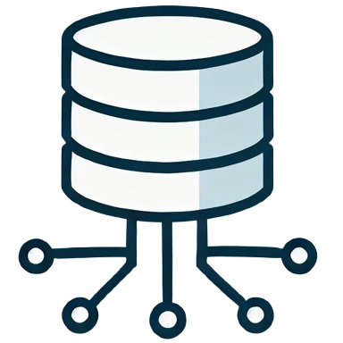

# CF | Data Handler

**Initial commit**: 09/02/25

**Stack**: Odoo, Owl, Python, JS, XML, HTML, CSS, SCSS, Bootstrap e BeautifulSoup.

**Sope**: In questa APP vengono introdottoti modelli che gestiscono batch di dati e loro
importazione/esportazione.

## Utilizzo:

Per ogni modello che si desidera gestire tramite questa APP, bisogna:

- Rintracciare **ir.model** relativo al modello che si vuole gestire.
  - **Settare a mano** - Campo `unique_fields_str`: Lista di campi che identificano in modo univo un Record.
  - **Verrà popolato** - Campo `unique_fields`
  - **Verrà popolato** - Campo `unique_fields_display`
  - **Controllare se** - Campo `x_data_id` esiste. Altrimenti premere bottone `Correggi Data ID`
  - **Controllare se** - Campo `x_data_hash` esiste. Altrimenti premere bottone `Correggi Data Hash`
  - 

